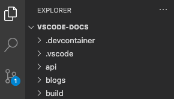
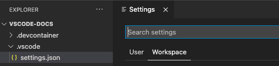

## workspace 概念

A Visual Studio Code workspace is the collection of one or more folders that are opened in a VS Code window (instance). In most cases, you will have a single folder opened as the workspace. However, depending on your development workflow, you can include more than one folder, using an advanced configuration called Multi-root workspaces.

The concept of a workspace enables VS Code to:

- Configure settings that only apply to a specific folder or folders but not others.
- Persist task and debugger launch configurations that are only valid in the context of that workspace.
- Store and restore UI state associated with that workspace (for example, the files that are opened).
- Selectively enable or disable extensions only for that workspace.

### workspace 类型和它们对于的 settings

- Single-folder workspaces：You don't have to do anything for a folder to become a VS Code workspace other than open the folder with VS Code.(当通过 "File > Open Folder" 打开某个目录就形成了一个 Single-folder workspaces) Once you open a folder, VS Code automatically keeps track of configuration, such as your open files or editor layout. When you reopen that folder in VS Code, the editor will be as you left it previously.

  A single-folder workspace opened inside VS Code.(如下图示)  
  

  Single-folder workspaces 的 settings:  Workspace settings are stored in .vscode/settings.json when you open a folder as a workspace.

### multi root workspace 多根工作间概念

### workspace settings

## vscode settings

VS Code provides different scopes for settings:

- User settings(用户范围的配置) - Settings that apply globally to any instance of VS Code you open.
- Workspace settings(针对工作空间范围的专有配置) - Settings stored inside your workspace and only apply when the workspace is opened.

Workspace settings are specific to a project and <strong>override</strong> user settings.

## tips

## extentions used
